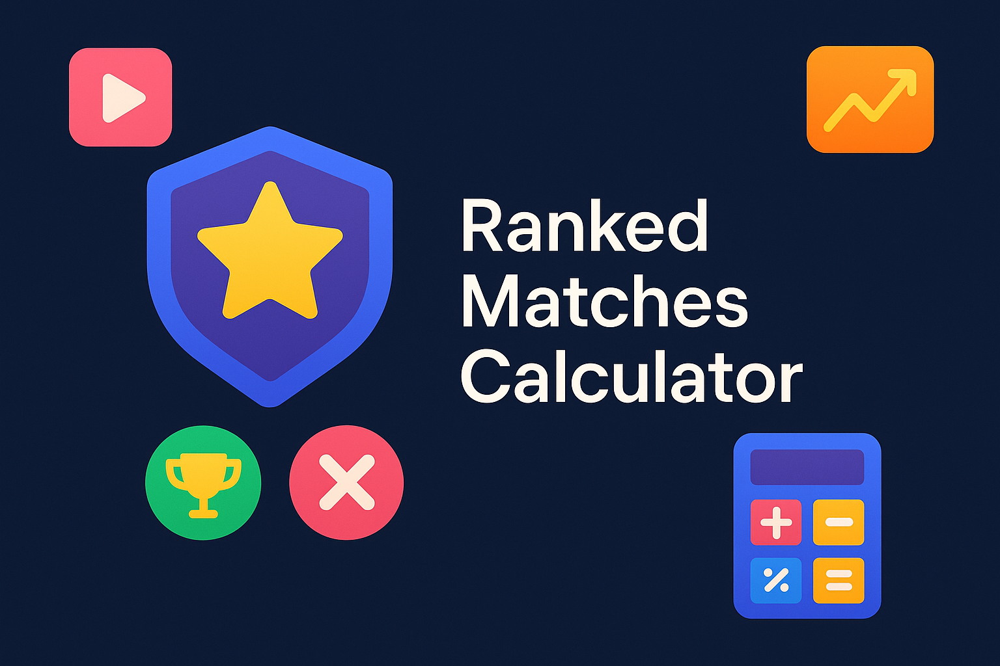

_**Read this in other languages:**_ [_**Português**_](README.md), [_**English**_](README.en.md).

# Ranked Matches Calculator

   

## 🇬🇧 English

### Project Description

This project is a simple calculator to determine a player's rank level in a ranked game based on the number of victories and defeats. It calculates the victory balance and assigns a level (Iron, Bronze, Silver, Gold, Diamond, Legendary, Immortal) according to the number of victories.

### How to Use

1.  **Access the Application:** Open the `index.html` file in your browser or visit the [project's GitHub Page](https://galafis.github.io/Calculadora-de-Partidas-Rankeadas/).
2.  **Enter Data:** In the form, enter the player's number of victories and defeats.
3.  **Calculate:** Click the "Calculate Level" button to see the victory balance and the corresponding level.

### Technologies Used

*   **HTML5:** For the web page structure.
*   **CSS3:** For styling and responsive layout.
*   **JavaScript (ES6+):** For calculation logic and interactivity.

### Rank Levels

The table below details the rank levels based on the number of victories:

| Victories     | Level       |
| :------------ | :---------- |
| Less than 10  | Iron        |
| 10 to 20      | Bronze      |
| 21 to 50      | Silver      |
| 51 to 80      | Gold        |
| 81 to 90      | Diamond     |
| 91 to 100     | Legendary   |
| More than 100 | Immortal    |

